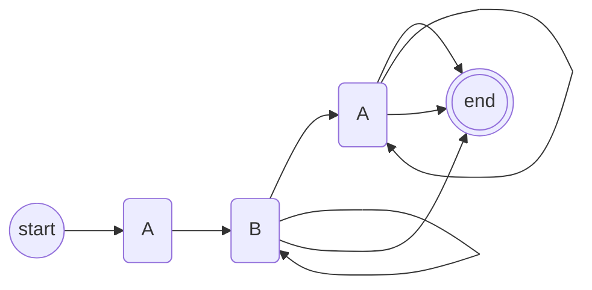
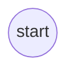
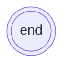
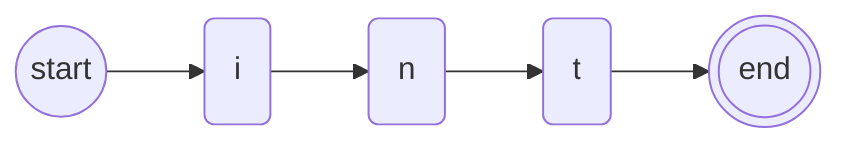
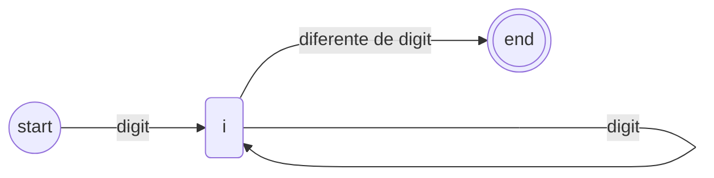

# Autômatos Finitos Determinísticos

## Você vai aprender

* O que é um Autômato Finito Determinístico (AFD)
* Quais são os elementos que compõem um AFD
* Para o que utilizamos uma AFD

## Pré-requisitos

* Noções básicas

## Definição

Um autômato finito é uma ferramenta matemática usada para modelar sistemas que seguem uma série de estados. Esses estados podem ser representados por círculos e as transições entre eles podem ser representadas por setas. Os autômatos finitos têm a capacidade de ler uma entrada, como uma sequência de símbolos, e mudar de estado de acordo com essa entrada.

Sendo assim, um Autômato Finito Determinístico, ou AFD, é um tipo específico de autômato finito que segue uma série de regras adicionais. Em um AFD, cada estado tem apenas uma transição para outro estado para cada símbolo de entrada possível. Isso significa que se o autômato estiver em um determinado estado e receber um determinado símbolo de entrada, ele sempre mudará para o mesmo estado. Por causa disso, o comportamento do AFD é determinado exclusivamente pelo estado atual e pelo próximo símbolo de entrada.

Eis um exemplo de Autômato Finito Determinístico:


AFDs são compostos por cinco (5) elementos importantes:

## Estados

Primeiramente temos o estado, que descreve a condição que uma cadeia está em determinado ponto do AFD. Temos dois
tipos de estados nos AFDs que são especiais:

### Estado inicial

É o ponto de partida para um AFD, é desse ponto que a nossa cadeia irá partir e então ser
passada para outros estados



### Estados Finais (ou Estados de Aceitação)

São pontos de paradas para os AFDs, se uma cadeia X que entrar em uma máquina, terminar sua leitura
em um Estado Final, quer dizer que tal cadeia foi aceita, caso contrário a mesma foi rejeitada



## Função de transição

Basicamente são funções que descrevem o requisito para uma cadeia transitar de um estado para outro.

Um exemplo prático seria o seguinte, vamos supor que queremos criar um AFD que leia a palavra "int", então teriamos
uma máquina parecida com isto:



Logo após o primeiro estado (start), teriamos o estado "i", mas para passarmos para o estado "i" precisamos de uma função de transição que irá "consumir" o próximo elemento da cadeia, e verificar se o mesmo é um "i".

Em outras palavras, pense que é como se literalmente fosse uma cadeia condicional

```python
state = START

def start(chr):
    
    if (chr == "i"):
        state = I
    else:
        raise Exception("Erro, caractere invalido")
```
        

Uma observação importante: uma função de transição pode fazer transição em um próprio estado, fazendo disso um loop.

Segue abaixo um exemplo de uma AFD para fazer a leitura de um número inteiro positivo.



## Alfabeto

No contexto das AFDs, o alfabeto constitui os símbolos que são aceitos pelo AFD, então no nosso exemplo
anterior do AFD que lê a palavra "int", o nosso alfabeto é composto dos caracteres que compõem a palavra
"int", ou seja:

Alfabeto = {'i','n','t'}

## Compiladores

Os autômatos finitos determinísticos (AFDs) são importantes no contexto de compiladores porque podem ser usados para modelar e reconhecer linguagens regulares. As linguagens regulares são uma classe importante de linguagens formais, que são frequentemente usadas para especificar a sintaxe de linguagens de programação.

Compiladores são programas que traduzem código-fonte de uma linguagem de programação para uma linguagem de baixo nível, como o código de máquina. Um dos principais componentes de um compilador é o analisador léxico, que é responsável por identificar os tokens do código-fonte.

Os AFDs podem ser usados para implementar o analisador léxico de um compilador. O processo envolve criar um AFD que reconheça todos os tokens válidos da linguagem de programação que está sendo compilada. Esse AFD pode ser construído manualmente ou gerado automaticamente a partir de uma especificação formal da linguagem.

Uma vez que o AFD é construído, ele pode ser usado pelo analisador léxico para identificar rapidamente os tokens do código-fonte. O analisador léxico segue as transições do AFD para reconhecer cada token individualmente, tornando o processo de análise léxica muito eficiente.

## Links úteis

[Veja outra aula sobre AFDs](https://edisciplinas.usp.br/pluginfile.php/5586355/mod_resource/content/1/ACH2043-Aula02-Cap1.1-AutomatosFinitosDetermin%C3%ADsticos.pdf)
