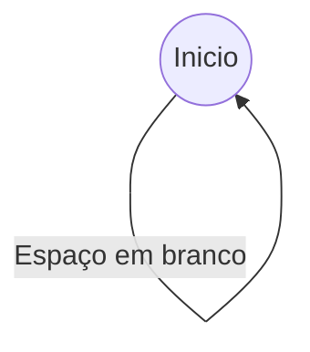
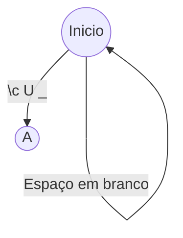
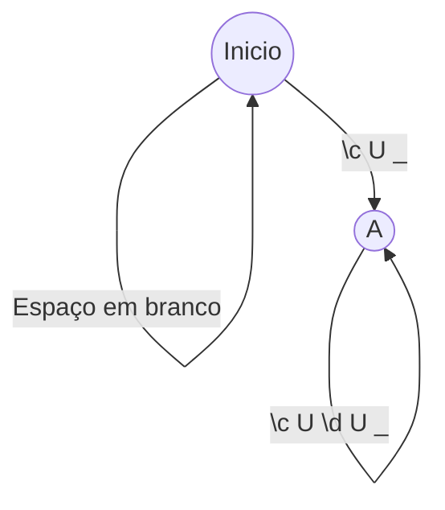
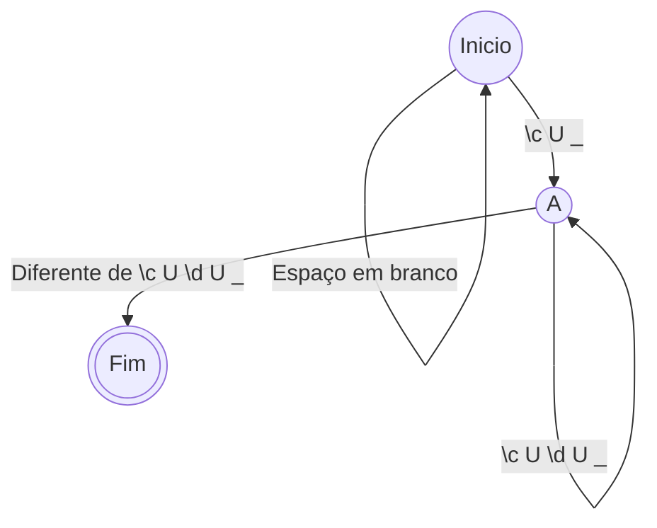
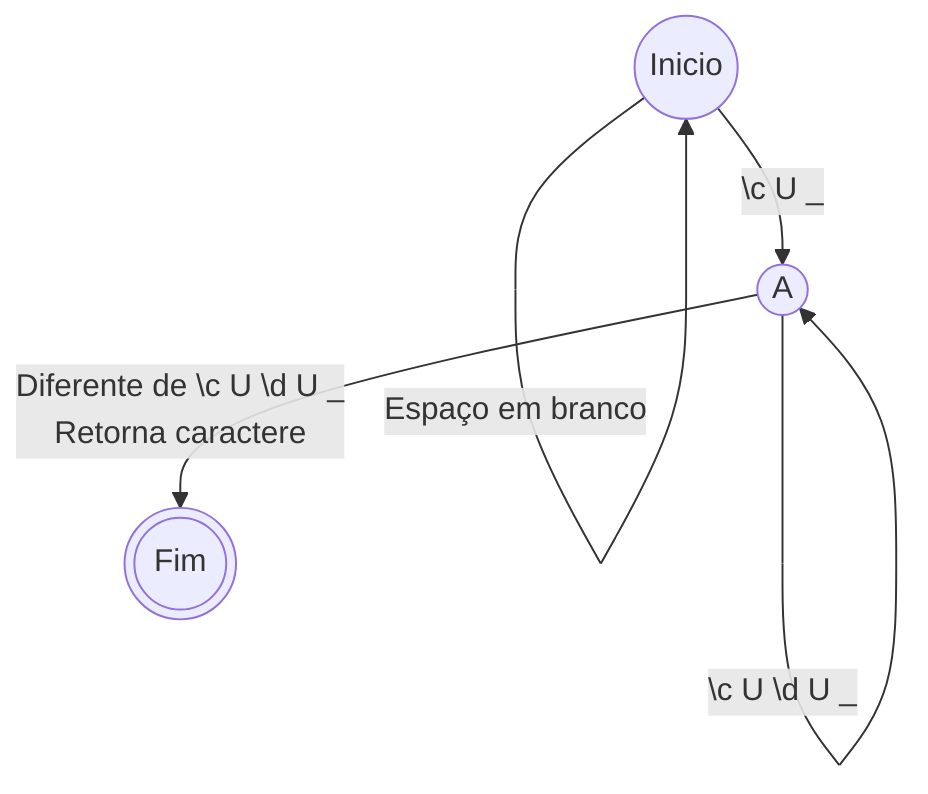

# Analisador Léxico - a primeira fase da Vanguarda

## O que você vai ver?

- O que é um Analisador Léxico
- Como funciona o Analisador Léxico

## Pré-requisitos 

- Introdução
- Tabela de Símbolos

## Definição

Um analisador léxico, também conhecido como lexer ou tokenizador, é um programa que recebe entrada na forma de um fluxo de caracteres e o divide em tokens. Esses tokens são normalmente substrings da entrada que são separados por algum tipo de delimitador, como espaço em branco ou pontuação.

O analisador léxico funciona lendo a entrada caractere por caractere e agrupando-os em tokens com base em padrões definidos por um conjunto de regras chamadas regras lexicais ou definições lexicais. Essas regras especificam os padrões que o lexer deve procurar na entrada, como palavras-chave, identificadores e pontuação.

Vamos considerar a seguinte entrada como um exemplo:
```x
x = 3 + 4;
``` 
Um lexer para esta entrada, por exemplo, pode reconhecer os seguintes tokens:
```x
Tipo - Identificador; Lexema -"x"
Tipo - Operador; Lexema - "="
Tipo - Literal; Lexema - "3"
Tipo - Operador; Lexema - "+"
Tipo - Literal; Lexema - "4"
Tipo - Pontuação; Lexema - ";"
``` 
O lexer leria a entrada caractere por caractere e os agruparia em tokens com base nas regras lexicais que foram definidas. Nesse caso, as regras podem especificar que os identificadores consistem em uma letra seguida por zero ou mais letras ou dígitos, os literais são sequências de dígitos e os operadores são determinados caracteres especiais, como '+' e '='.

Uma vez que a entrada tenha sido dividida em tokens, ela pode ser passada para outras partes do compilador ou interpretador, como o analisador sintático, que usará os tokens para construir uma árvore sintática ou realizar outras operações.

## Regras lexicais

Tais regras definem quais tokens são considerados, quando eles são ignorados, e quando a formação de um token é "ilegal" e o compilador precisa alertar ao usuário que o seu programa possui algum erro léxico. Geralmente construimos essas regras e o próprio Analisador Léxico, usando um Autômato Finito Determinístico (AFD), pois nele definimos fases de transição que indicam a construção de um token, e o estado final indica que encontramos um token que precisa ser processado.

### Criando uma AFD

Vamos criar um autômato simples para exemplificar o processo de criação do Analisador Léxico. Para isso, iremos criar um que se assemelha bastante as regras lexicais da linguagem C, focando em criar apenas duas regras, a leitura de espaço em branco, e a leitura de nomes de variáveis.

Primeiramente, temos o estado inicial, assim como qualquer AFD. Aqui teremos uma transição para si mesmo (um loop) enquanto um espaço em branco for lido. Lembre-se, espaço em branco não é um token na linguagem C, mas sim, um delimitador léxico.



Agora, precisamos criar estados de transição para a leitura dos nomes das variáveis. Pense o seguinte, quais são as regras que define os nomes das variáveis? Bem, o nome precisa começar com letra, ou sublinhado ou seja: (\c $\cup$ \_).

Obs.: Variáveis não podem começar com dígitos.

Em seguida, podemos ter (ou não) uma sequência infinita de letras, dígitos ou sublinhado. Então quer dizer, que a nossa expressão regular será parecida com isso: (\c $\cup$ \_)(\c $\cup$ \d $\cup$ \_)\*. 

Com a expressão escrita, vamos traduzir isso para a AFD. A primeira transição sera atendida, quando uma letra ou um sublinhado for lido.



A segunda transição será do estado A para ele mesmo, ou seja, um loop irá acontecer no estado A, enquanto uma letra, digito ou sublinhado for lido.



Por fim, teremos a ultima transição, que indica o fim do nosso token. Essa transição irá acontecer quando qualquer coisa diferente de letra, digito ou sublinhado for lido.



Com isso, já temos parte um Analisador Léxico para a nossa linguagem hipotética, parecida com C.

Vale a pena observar que ao fazer transição para o estado final, o que pode acontecer com frequência é o AFD (e inclusive acontece nesse caso) retornar o último caractere lido. Isso acontece pois o último caractere lido pode ser o próximo token, e por conta disso, precisamos "retornar" esse caractere, para que o mesmo possa ser lido novamente.



Mas como é que o Analisador faz isso na prática? Iremos dar uma olhada nisso e mais, na aula de laboratório.

# Línks úteis

- [Compilador para humanos - Análise Léxica](https://johnidm.gitbooks.io/compiladores-para-humanos/content/part1/lexical-analysis.html)
- [Aula 06 - Análise Léxica - Judson Santiago](https://youtu.be/gzY-CTY4msg)
