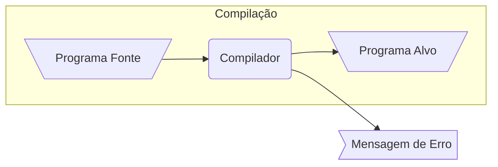
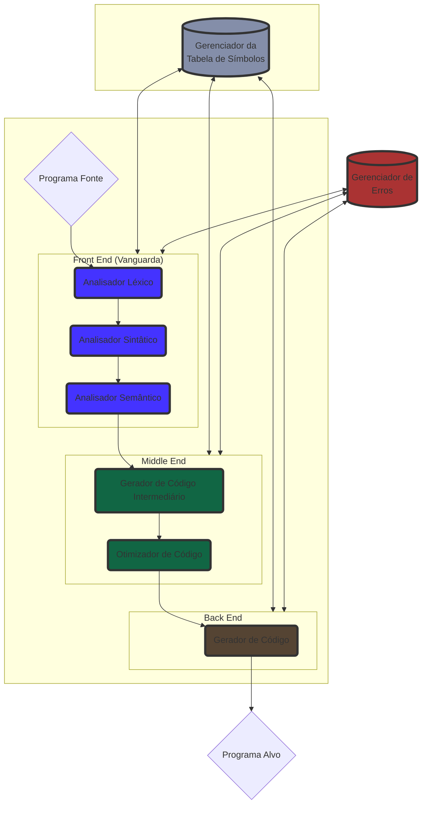

# Introdução a Compiladores

# Gustavo Lopes Rodrigues

## O que você vai aprender

- O que é um Compilador.
- Qual é a diferença entre Compiladores e Interpretadores.
- Quais são as fases de um Compilador.

## Pré-requisitos

- Noções básicas de Fundamentos Teóricos da Computação.

## Definição

Até então na programação o que temos feito é sermos usuários de Linguagens de Programação como C, C++, Java, Python e entre outros. Agora
neste microfundamento, iremos aprender como fazer a nossa própria Linguagem a partir de um software chamado de Compilador.

Um Compilador é um programa que converte um programa escrito em uma linguagem fonte (como C++), em um terceiro programa escrito em linguagem alvo (Assembly ou L.M.)  L.M. = Linguagem de Máquina.



Vamos ver de perto um exemplo disso, aqui embaixo você irá encontrar um código talvez bem familiar.

```c
#include<stdio.h>

int main() {
  printf("Hello world!\n");
  return 0;
}
```

O que temos nesse exemplo é um código na linguagem C, que no nosso caso é a chamada **Linguagem Fonte** e o seu arquivo é o nosso **Programa Fonte**. Para a máquina essa sopa de letrinhas não possui nenhum significado, e podemos verificar isso, rodando o comando **file** do Linux neste arquivo, e verificando que o mesmo é apenas um arquivo de texto.

``` 
$ file main.c
main.c: C source, ASCII text
``` 

Para que este arquivo de texto tenha um significado para o computador, iremos chamar um compilador, neste caso como estamos lidando com a linguagem C
usarei o conhecido GCC (Gnu C Compiler).

```
$ gcc main.c
```

Ao invocarmos esse comando, estamos pedindo para o compilador compilar o nosso arquivo ```main.c``` e o tempo necessário para 
compilar o nosso arquivo, nós chamamos de **Tempo de compilação**. O resultado da execução desse comando irá gerar um arquivo 
chamada ```a.out```, que é o nosso **Programa Alvo**. Como estou em uma máquina Linux, o resultado do GCC será um programa escrito em Assembly x86_64(Essa seria a nossa **Linguagem Fonte**), específico para a arquitetura e o Sistema Operacional do meu computador.

Obs.: Podemos novamente confirmar o tipo de arquivo gerado pelo compilador, se rodarmos o comando **file**, desta vez no arquivo ```a.out```. O resultado desse comando nos informa que o nosso ```a.out``` é nada mais do que um Executable and Linkable File (ELF) de 64 bits, um padrão de arquivos executáveis no Linux.

``` 
$ file a.out
a.out: ELF 64-bit LSB pie executable, x86-64...
``` 

Agora vamos então rodar esse nosso programa compilado.

```
$ ./a.out
Hello World!
``` 


Obs.: Se eu mandar esse mesmo ```a.out``` para outra máquina Linux, o meu programa irá rodar, mas se eu mandar para outro Sistema Operacional
(como o Windows) ou para um computador com outra arquitetura (Como ARM ou Risc-V), esse código não irá rodar.

Aqui, quando executamos esse comando estamos rodando o nosso programa, o intervalo em que um programa permanece em execução
é chamado de **Tempo de execução**.

## Interpretador

Muitos de vocês já devem ter utilizado linguagens com Python, Java, Javascript e entre outras. Essas linguagens possuem um programa chamado de Interpretador.

Diferente do compilador que tem como objetivo gerar um arquivo escrito na Linguagem Alvo, o Interpretador é um programa que lê um arquivo (código fonte) e interpreta tal arquivo e converte em código executável linha por linha.

Nós não iremos entrar em grande detalhe sobre o funcionamento desses programas, pois não é o foco da disciplina, a coisa mais importante que você precisa entender aqui, é diferente do compilador, o Interpretador não irá gerar um arquivo com a Linguagem Alvo, pois o código será executado na medida que for analisado. Além disso, o tempo de compilação e execução são diferentes, aqui o tempo de compilação e execução são os mesmos.

## Fases do Compilador



Agora que temos uma noção geral do compilador, podemos agora falar sobre as fases do Compilador. O Compilador pode ser dividido em três seções, o Front-End (Vanguarda), o Middle-End e o Back-End (Retaguarda).

## Front-End

O Front-End possui dois componentes, o Analisador Léxico e o Analisador Sintático

### Analisador Léxico

O Analisador Léxico, também chamado de "A fase de Scanning" é a parte onde o Compilador irá fazer a tokenização do código fonte.

### Analisador Sintático

## Middle-end

### Geração de Código Intermediário

### Otimização de Código

## Back-end

### Gerador de Código

# "Primos" do Compilador

Além do Compilador, seria interessante você entender mais dois programas que são fundamentais na geração do código.

## Montador

O primeiro deles é o montador, alguns compiladores possuem um montador embutido, mas a sua função é traduzir o código gerador pelo Compilador (Assembly) e transformar em uma representação intermediária chamada de código objeto. Este código de montagem é uma versão mnemônica do código de máquina, onde é utilizado nomes em lugar de código de máquina. Para transformar esse código, em um programa que a máquina possa ler, iremos usar o segundo programa, o Linkeditor

## Linkeditor 

O Linkeditor, Ligador ou Editor de Ligações tem como objetivo permite criar um único módulo de carga, a partir de vários arquivos de código objeto. Isso acontece pois vamos supor que estamos trabalho em um projeto com vários arquivos diferentes, cada um deles vai gerar o seu próprio arquivo de código objeto. No final da compilação, cabe ao Linkeditor pegar todos esses arquivos e juntá-los em um executável apenas.
