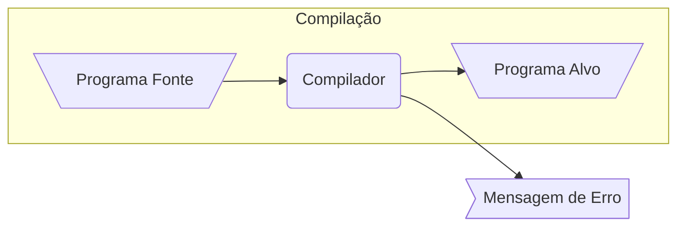
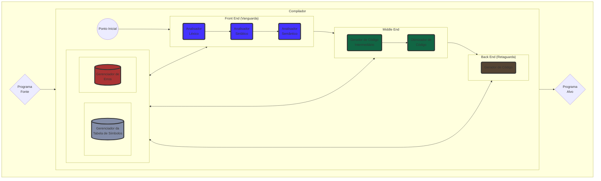
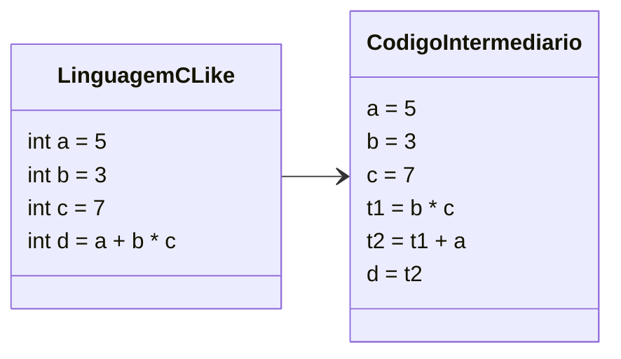
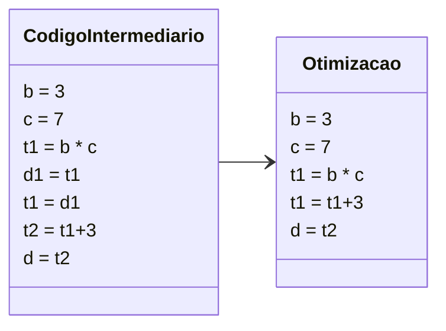
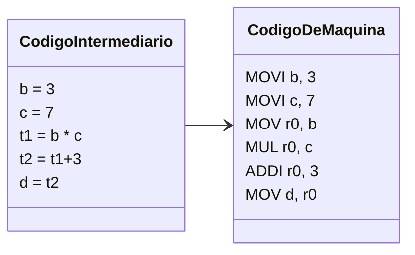

# Visão geral e conceitos principais

## O que você vai aprender

* O que é um Compilador.
* Qual é a diferença entre Compiladores e Interpretadores.
* Quais são as fases de um Compilador.

## Pré-requisitos

* Noções básicas de Fundamentos Teóricos da Computação.

## Seja bem vindo a Compiladores

Nesta aula do microfundamentos você terá uma visão panorâmica dos mais importantes conceitos que você precisa saber na disciplina. De certa forma, para uma primeira aula esta é bem grande, mas não se preocupe, iremos voltar nesses conceitos sempre quando for necessário, por enquanto, seja bem vindo a Compiladores e espero que goste desta aula introdutória :).

## O que é um Compilador?

Até então na programação o que temos feito é sermos usuários de Linguagens de Programação como C, C++, Java, Python e entre outros. Agora neste microfundamento, iremos aprender como fazer a nossa própria Linguagem a partir de um software chamado de Compilador.

Um Compilador é um programa que converte um programa escrito em uma linguagem fonte (como C++), em um terceiro programa escrito em linguagem alvo (Assembly ou L.M.) L.M. = Linguagem de Máquina.



Vamos ver de perto um exemplo disso, aqui embaixo você irá encontrar um código talvez bem familiar.

```c
#include<stdio.h>

int main() {
  printf("Hello world!\n");
  return 0;
}
```

O que temos nesse exemplo é um código na linguagem C, que no nosso caso é a chamada **Linguagem Fonte** e o seu arquivo é o nosso **Programa Fonte**. Para a máquina essa sopa de letrinhas não possui nenhum significado, e podemos verificar isso, rodando o comando **file** do Linux neste arquivo, e verificando que o mesmo é apenas um arquivo de texto.

```
$ file main.c
main.c: C source, ASCII text
```

Para que este arquivo de texto tenha um significado para o computador, iremos chamar um compilador, neste caso como estamos lidando com a linguagem C usarei o conhecido GCC (Gnu C Compiler).

```
$ gcc main.c
```

Ao invocarmos esse comando, estamos pedindo para o compilador compilar o nosso arquivo `main.c` e o tempo necessário para compilar o nosso arquivo, nós chamamos de **Tempo de compilação**. O resultado da execução desse comando irá gerar um arquivo chamada `a.out`, que é o nosso **Programa Alvo**. Como estou em uma máquina Linux, o resultado do GCC será um programa escrito em Assembly x86\_64(Essa seria a nossa **Linguagem Fonte**), específico para a arquitetura e o Sistema Operacional do meu computador.

Obs.: Podemos novamente confirmar o tipo de arquivo gerado pelo compilador, se rodarmos o comando **file**, desta vez no arquivo `a.out`. O resultado desse comando nos informa que o nosso `a.out` é nada mais do que um Executable and Linkable File (ELF) de 64 bits, um padrão de arquivos executáveis no Linux.

```
$ file a.out
a.out: ELF 64-bit LSB pie executable, x86-64...
```

Agora vamos então rodar esse nosso programa compilado.

```
$ ./a.out
Hello World!
```

Obs.: Se eu mandar esse mesmo `a.out` para outra máquina Linux, o meu programa irá rodar, mas se eu mandar para outro Sistema Operacional (como o Windows) ou para um computador com outra arquitetura (Como ARM ou Risc-V), esse código não irá rodar.

Aqui, quando executamos esse comando estamos rodando o nosso programa, o intervalo em que um programa permanece em execução é chamado de **Tempo de execução**.

## Interpretador

Muitos de vocês já devem ter utilizado linguagens com Python, Java, Javascript e entre outras. Essas linguagens possuem um programa chamado de Interpretador.

Diferente do compilador que tem como objetivo gerar um arquivo escrito na Linguagem Alvo, o Interpretador é um programa que lê um arquivo (código fonte) e interpreta tal arquivo linha-por-linha e converte em código executável.

Nós não iremos entrar em grande detalhe sobre o funcionamento desses programas, pois não é o foco da disciplina, a coisa mais importante que você precisa entender aqui, é que, diferente do compilador, o Interpretador não irá gerar um arquivo com a Linguagem Alvo, pois o código será executado na medida que for analisado. Além disso, o tempo de compilação e execução são diferentes no Compilador, já no Interpretador o tempo de compilação e execução são os mesmos.

## Fases do Compilador



Agora que temos uma noção geral do compilador, podemos agora falar sobre as fases do Compilador. O Compilador pode ser dividido em três seções, o Front-End (Vanguarda), o Middle-End e o Back-End (Retaguarda).

Obs.: Uma importante coisa a ser notada, é que as fases do Compilador acontece de forma simultânea.

## Front-End

O Front-End possui três componentes, o Analisador Léxico, Analisador Sintático e o Analisador Semântico

### Analisador Léxico

O Analisador Léxico, também chamado de "A fase de Scanning" é a parte onde o Compilador irá fazer a tokenização do código fonte. A sequência de caracteres do programa-fonte é lida da esquerda para a direita em busca de elementos da linguagem (tokens). Responsável em identificar lexemas no programa-fonte, verificando a correção “ortográfica” do código e os tokens correspondentes.

Exemplo de erro do Analisador Léxico seria esse código:

```c
#include<stdio.h>

int main() {
    int a = 10.0.0;
    printf("%d\n", a);
    return 0;
}
```

Não existe o lexema "10.0.0" na linguagem C.

**Lexemas**

Lexemas é a forma na qual um token é escrito no programa fonte. Quando o programa for analisado, os lexemas serão lidos e então convertidos para tokens que o programa fonte pode compreender.

Lexemas podem ser escritos ou de forma literal ou usando regex:

| tokens | lexemas                                  |
| ------ | ---------------------------------------- |
| id     | (\c $\cup$ \_)(\c $\cup$ \d $\cup$ \_)\* |
| int    | "int"                                    |
| float  | "float"                                  |
| +      | +                                        |
| inc    | ++                                       |

Obs.: id = identificador

Outras observações importantes:

* Espaço em branco não é token e sim um delimitador léxico
* Quebra-de-linha em algumas linguagens é um Token, em outras linguagens não
* Comentário não é token, nem a mensagem, nem os seus delimitadores
* Diretivas (#define) (#include) são comandos para o compilador ( não tokens )

### Analisador Sintático

Também chamado de Análise Hierárquica, essa fase é responsável em agrupar os tokens em estruturas hierárquicas seguindo as regras de produção da gramática. Responsável por agrupar os itens léxicos (tokens) em estruturas hierárquicas. Cada token identificado pelo Analisador Léxico é armazenado na tabela de símbolos e sua posição verificada através da gramática.

Exemplo de erro do Analisador Léxico seria esse código

```c
#include<stdio.h>

int main() {
    int b = 5;
    int a = 3;
    int c = + a b;
    printf("O resultado de a + b é %d", c);
    return 0;
}
```

De acordo com a gramática, o + deveria vir entre os identificadores **a** e **b**, porém isso não acontece, gerando um erro.

### Analisador Semântico

Nesta fase, os componentes do programa são checados para se garantir sentido às estruturas. Responsável por verificar a coerência das estruturas, quanto ao seu contexto, tipos de operandos e operadores, declaração de variáveis e constantes, entre outros.

Exemplo de erro do Analisador Semântico seria:

```c
#include<stdio.h>

int main() {
    int a = 10.7;
    printf("%d\n", a);
    return 0;
}
```

Neste caso, temos uma incompatibilidade de tipos, pois o identificador é do tipo "int" mas o valor atribuído é um "float".

## Middle-end

Aqui temos a segunda parte da compilação, o Middle-end, que possui em si duas fases, a Geração de Código Intermediário e a Otimização de Código

### Geração de Código Intermediário

Inicialmente temos a Geração de Código Intermediário, responsável por representar as estruturas sintáticas encontradas na forma de um programa para uma máquina abstrata. Esta representação intermediária facilita a conversão do programa fonte para o programa alvo.



Obs.: t1 e t2 são variáveis temporárias

### Otimização de Código

Permite melhorar a representação intermediária, com o objetivo de produzir um código final mais eficiente.



## Back-end

Por fim, temos o Back-end, onde aqui temos apenas uma única fase, que é o chamado Gerador de Código.

### Gerador de Código

Na fase final da compilação, o Gerador de Código realiza a conversão do código intermediário já otimizado, para o código alvo.



## "Primos" do Compilador

Além do Compilador, seria interessante você entender mais dois programas que são fundamentais na geração do código.

### Montador

O primeiro deles é o montador, também chamado de Assembler. Sua função é traduzir o código gerador pelo Compilador (Assembly) e transformar em uma representação intermediária chamada de código objeto. Este código de montagem é uma versão mnemônica do código de máquina, onde é utilizado nomes em lugar de código de máquina.

Um exemplo muito famoso, e inclusive usado até hoje, é o [NASM](https://www.nasm.us/)

### Linkeditor

Para transformar esse código, em um programa que a máquina possa ler, iremos usar o segundo programa, o Linkeditor, que tem como objetivo criar um único módulo de carga (executável), a partir de vários arquivos de código objeto. Isso acontece pois vamos supor que estamos trabalho em um projeto com vários arquivos diferentes, cada um deles vai gerar o seu próprio arquivo de código objeto. No final da compilação, cabe ao Linkeditor pegar todos esses arquivos e juntá-los em um executável apenas.

### Conclusão

Ufa, foi até bastante coisa para apenas uma aula só, mas acredito que agora vocês tenham conseguido um panorama a respeito de todos os importantes tópicos que iremos ver nesse microfundamentos. Aproveite também para dar uma olhada no nosso material extra, muito obrigado e até a próxima.

## Links úteis

* [Aula introdutória de Compiladores](https://youtu.be/Q5lLGCOSYIk)
* [Aula completa de Compiladores da UFMG](https://homepages.dcc.ufmg.br/\~bigonha/Cursos/comp-slides-p4.pdf)
