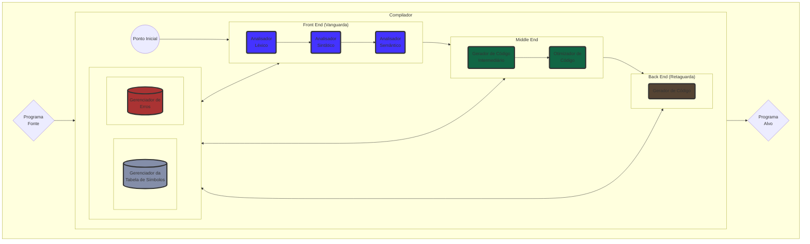

# Introduzindo a base do nosso Compilador

# Gustavo Lopes Rodrigues

## O que veremos nesta aula

- Leitura do arquivo fonte
- Criação da classe do Compilador
- Criação da classe do Token

## Definindo objetivos

Nesta primeira aula iremos começar a fazer os primeiros componentes do nosso Compilador, e fazer lógica básica que irá compor o nosso programa como um todo. Aqui nós teremos três responsabilidades que precisam ser tratadas nesta aula, que no caso seria, pegar as linhas do nosso arquivo fonte, a classe 
do Compilador e a classe to Token.

# Extraindo o texto do arquivo fonte

Primeiramente antes de começar o processo de Compilação, nós iremos precisar de pegar o nosso arquivo fonte, para o meu caso decidi ela será extraído 
fazendo leitura de arquivo, usando as bibliotecas leitura de arquivo em C++.

```c++ 
#include<iostream>
#include<fstream>
#include<vector>

std::vector<std::string> get_file_lines(std::string file_path);

int main(int argc, char* argv[]) {
  
    if (argc < 1) {
      std::cout << "Error! No file specified!" << "\n";
      return -1;
    }

    std::vector<std::string> file_lines = get_file_lines(std::string(argv[1]));
}

std::vector<std::string> get_file_lines(std::string file_path) {
    std::fstream file;
    file.open(file_path, std::ios::in);

    std::vector<std::string> lines;
    std::string curr_line = "";

    if (file.is_open()) {
        while (std::getline(file, curr_line)) 
          lines.push_back(curr_line);

        file.close();
    } else {
        std::cout << "Erro! the file " << file_path << " does not exist!\n";
        exit(1);
    }
    
    return lines;
}
``` 

Caso este código esteja confuso para você, dê uma olhada na documentação das bibliotecas do [std::vector](https://en.cppreference.com/w/cpp/container/vector) e do 
[std::fstream](https://linuxhint.com/use-cpp-fstream/), mas em resumo, se você olhar na função *main* teremos como resultado o vetor **file_lines** que irá conter
em cada posição do vetor as linhas do nosso programa fonte. Nós podemos confirmar isso, se imprimirmos o resultado disso na tela usando um *for* loop, dessa maneira:

```c++
int main(int argc, char* argv[]) {
  
    if (argc < 1) {
      std::cout << "Error! No file specified!" << "\n";
      return -1;
    }

    std::vector<std::string> file_lines = get_file_lines(std::string(argv[1]));
    
    for (auto line : file_lines) {
        std::cout << line << "\n";
    }
}
```
Se colocarmos o nosso programa de exemplo ```main.x``` aqui, ele irá imprimir todas as linhas do nosso programa:
```
g++ main.c
./a.out main.x
```
```c
string nome;

write("Digite seu nome: ");
readln(nome);

float percentual;
int i:=1;
const N=10;
While (i<=N) {
  percentual:=float(i)/N;
  writeln(percentual,": Ola' ",nome);
  i:=i+1;
}
```

Perfeito, e assim a nossa primeira responsabilidade está feita, podemos passar para a segunda, que é criar a classe do Compilador

# Classe do Compilador

Se você se lembra da aula introdutória a disciplina, você deve se lembrar desse diagrama aqui, que utilizei para ilustrar como é um Compilador:


Provavelmente você deve ter percebido, mas esse diagrama está ilustrando um dos Padrões GOF, chamado **Facade**. Um [Facade](https://refactoring.guru/pt-br/design-patterns/facade) é nada mais do que um padrão de projeto do tipo estrutural que tem como objetivo fornecer ao programador uma interface simplificada para uma biblioteca, um framework, ou um conjunto qualquer de classes com um comportamento complexo.


Fonte: https://refactoring.guru/pt-br/design-patterns/facade

E como pode-se perceber essa definição é exatamente o que o nosso compilador é: um conjunto de classes que expressão um comportamento complexo, que no nosso caso é transformar um programa fonte, em código que a máquina possa compreender. Caso ainda não tenha ficado muito claro isso, não se preocupe, nós iremos desenvolver a aplicação juntos e isso ajudará a trazer mais clareza em como esse padrão de projeto funciona.

Além disso, como não temos ainda muito dos componentes que será o nosso Facade, então iremos apenas deixar em grande parte a ideia, e depois iremos adicionando os elementos um por um a medida que eles forem realmente feitos.

Sem mais interrupções, vamos então criar a nossa classe

```c++
#include<string>
#include<vector>
#include"error_manager"

class Compiler {

  private:
  
    //SymbolTable symbol_table;
    //LexicalAnalyzer lexical_analyzer;
    //Parser parser;
    //IntermediateCode intermediate_code;
    //AssemblyGenerator assembly_generator;

  public:

    Compiler() {
    }
    
    bool compile(std::vector<std::string> file_lines) {
      return false;
    }
};

```

Então essa é a ideia básica, uma classe onde todos os componentes do nosso Compilador se unem e temos a nossa funcao *compile* que irá pegar o vetor de linhas (programa fonte) e irá retornar um boolean se por acaso o processo de compilação foi um sucesso ou não. Por fim, vamos instanciar a nossa classe compilador na main.

```c++
int main(int argc, char* argv[]) {
  
    if (argc < 1) {
      std::cout << "Error! No file specified!" << "\n";
      return -1;
    }

    std::vector<std::string> file_lines = get_file_lines(std::string(argv[1]));
    
    Compiler compilerX = Compiler();
    bool result = compilerX.compile(file_lines);
}
```

Como dito anteriormente, nos ainda não temos todos os componentes do nosso Compilador para fazer o nosso Facade, mas isso será mais do que o suficiente por agora, e ao longo do tempo iremos melhorar e adicionar os elementos que faltarem.


# Classe do Token

Precisamos de uma classe que será responsável em guardar os dados dos tokens que serão lidos do programa fonte, por isso iremos criar essa classe chamada: Token. Além disso, precisamos entender quais são as informações que um Token pode ter:

- Lexema - formato original do token no código fonte
- Tipo - define o tipo de dado (data type) (ex: inteiro, float, boolean)
- Classe - define como o token foi inicializado (ex: variável, constante)
- Tamanho - o tamanho que esse token irá ocupar em memória (isso será importante quando implementarmos o código em assembly)
- Endereço  - o endereço onde o token será armazenado em memória (isso será importante quando implementarmos o código em assembly)

O lexema pode ser guardado em formato de texto, já que é a maneira na qual o código fonte é guardado no código, o tipo de dado, podemos usar Enums (ou enumerators) para representar cada tipo de dado. Caso você não tenha familiaridade com Enums, sugiro dar uma olhada [nesta aula daqui](https://www.simplilearn.com/tutorials/cpp-tutorial/cpp-enum). A classe do Token também pode ser guardada usando enum, já o tamanho do token podemos usar um *std::size_t* que é um número inteiro sem sinal, de 16 bits. Pelo fato que tamanho não pode ser negativo e temos um limite no qual um token pode ter de tamanho, esse formato se demonstra perfeito para nós. Por fim, o endereço por ter que representar valores hexadecimais, podemos usar o tipo *long*.
